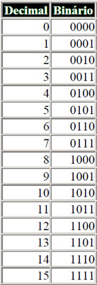

# Sistema Numerico

## Base decimal 

O que usamos normalmemente

## Base binária

Utiliza os dois primeiros algarismos indo-arábicos da base decimal para representá-
los, a saber: '0' e '1'.

## Base octal 

Uma opção é a base octal. Ela é composta de oito algarismos.
## Base hexadecimal

Esta base é composta de dezesseis algarismos: 0, 1, 2, 3, 4, 5, 6, 7,
8, 9, A, B, C, D, E, F.