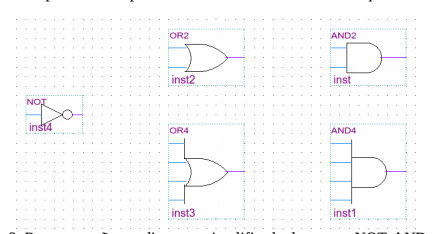
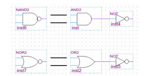
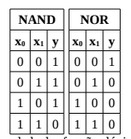

# Funções e Portas Lógicas

## Funções Lógicas Primárias

- NOT
- AND
- OR

O resultado da função lógica NOT de um sinal de entrada x, atribuído a uma variável y, pode ser
descrito da seguinte maneira: y = x. A representação para a função AND de dois sinais de entradas x1 e x2
é dada por y = x1·x2 ou y = x1x2. Finalmente, a representação da função OR de duas entradas x1 e x2 é
descrita por y = x1+x2.

## Porta Lógicas

Uma porta lógica consiste em um conjunto de transistores interligados que, dados conjuntos de
sinais digitais de entrada e de saída, possuem um comportaménto análogo ao de uma função lógica. Ou
seja, podemos utilizar as funções lógicas para definir o comportamento dos sinais de saída de uma porta
lógica.

## Outras portas lógicas

As portas NAND e NOR são versáteis pois podem implementar as três portas primárias. A porta NAND
consiste de uma porta AND seguida de uma porta NOT e a porta NOR trata-se de uma porta OR seguida
de uma porta NOT.

As expressões algébricas para as portas XOR e XNOR são dadas por y = x1⊕x2 e y = x1⊕x2,
respectivamente.
