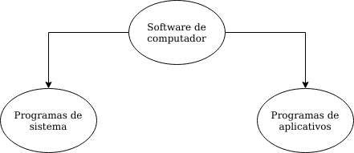
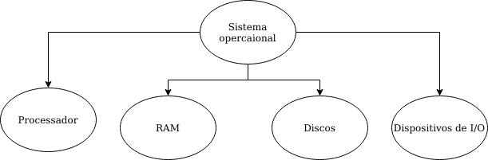
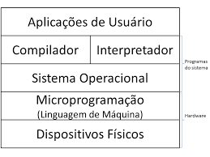
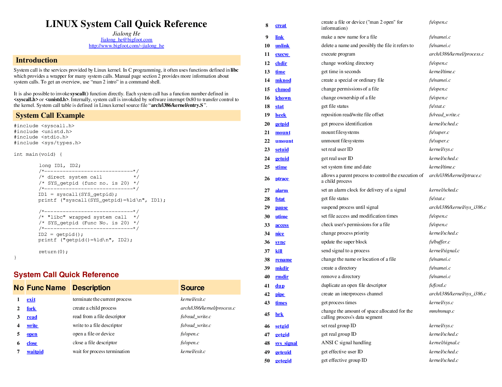
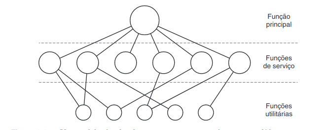
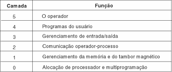
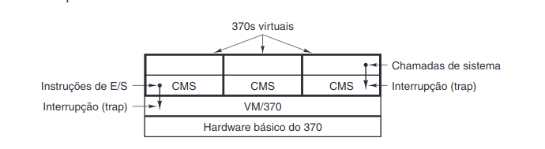

# Aspectos gerais 

O Software pode ser dividido a grosso modo, em duas espécies:

**Programas de sistemas:** que gerenciam a opreção do computador em si.
**Programas de aplicativos:** que executam o trabalho que o usuário realmente deseja.

**Microprograma**: Software primitivo que controla diretamente o hardware.

Uma função importante do sistema operacional é esconder toda essa complexidade e oderecer um conjunto mais conveniente para o programador trabalhar.
O sistema operacional é aquela porção do software que executa o _modo kernel_ ou no _modo de supervisor_. 

Os compiladores e editores executam no _modo usuário_

## O que é um sistema operacional

O programa que esconde do programador a verdade sobre o hardware e apresenta uma bela e simples visão de nomes de nome de arquivos que podem ser gravados. E também gerenciar todas as partes de um sistema complexo.

## A história dos sistemas Operacionais

Primeira geração (1945- 55) - Válvulas e painéis de conectores
Segunda geração (1955 - 65) - Transistores e sistema de lotes
Terceira geração (1965 - 1980) - CIs e multiprogramação
Quarta geração (1980 - hoje) - Computadores pessoais

## Conceitos de sistema operacional

**Chamadas de sistemas:** Instruções extendidas que o s.o proporciona.

As chamadas de sistema do MINIX se dividen-se grosseiramente em duas categorias amplas, aquelas que lidam com processos e aquelas que lidam com sistema de arquivos.

### Processos 

É basicamente um programa de execução. 

**Espaço de endereçamento**: Uma lista de locais na mémoria que o processo pode ler e guardar.
**Tabela de processos:**: Uma lista encadeada de estruturas para cada processo existente para registrar informações como os ponteiros que armazena q posição atual do processo.

### Arquivos

**Diretório**: Uma maneira de agrupar arquivos, organizado em árvores.
Os aqruivos e os diretorórios no MINIX são protegidos designando um código binário de proteção de 9 bits a cada um. O código de proteção consiste em três camos de 3 bits, um para o proprietário, um para os membros do grupo do proprietário e um terceiro para todas as demais pessoas. Cada cambo tem um bit para acesso de leitura(_read_), um bit para acesso de gravação(_write_) e um bit para acesso de execução. Esses três bits são conhecidos como *bits rws*

**Pipe**: Um pseudo arquivo que pode ser utilizado para conectar dois processos

### Shell

Interpretador de comandos do MINIX

### Chamadas de sistema

**argc**: é uma contagem de número de itens da linha de comando, incluindo o nome do programa.

**argv**: é um ponteiro para uma matriz

**envp**: é um ponteiro para um ambiente

No MINIX 3, os processos têm sua memória dividida em três segmentos: o segmento de texto (isto é, o código do programa), o segmento de dados (isto é, as variáveis do progra-ma) e o segmento de pilha. 

## Arquitetura de sistemas operacionais

### Sistemas monoliticos

* Caracterizando-se por permitir que o processador, a mémoria e os perifericos permaneçam exclusivamente dedicados á execução de um único programa.

* Recursos são mal utilizados, entretanto são implementados com facilidade

* usado em sensores/ sistemas embarcados
O sistema operacional é escrito como um conjunto de rotinas, cada uma das quais podendo chamar qualquer uma das outras sempre que precisar. 
Os serviços (chamadas de sistema) fornecidos pelo sistema operacional são soli-citados colocando-se os parâmetros em lugares bem defi nidos, como em registradores ou na pilha e, então, executando-se uma instrução de interrupção especial, conhecida como *chamada de núcleo* ou *chamada de supervisor*

1. Um programa principal que ativa a função de serviço solicitada.
2. Um conjunto de funções de serviço que executam as chamadas de sistema.
3.  Um conjunto de funções utilitárias que ajudam as funções de serviço.

### Sistema em camadas

### Maquinas virtuis

O centro do sistema, conhecido como *monitor de máquina virtual*, era executado no hardware básico e fazia a multiprogramação, oferecendo não uma, mas várias máquinas vir-tuais à camada superior seguinte

### Modelo cliente/servidor

Uma tendência nos sistemas operacionais modernos é levar ainda mais longe essa idéia de mover código para camadas mais altas e remover o máximo possível do sistema opera-cional, deixando um núcleo mínimo, o micronúcleo (microkernel). A estratégia normal é implementar a maior parte das funções do sistema operacional em processos de usuário. Para solicitar um serviço, como ler um bloco de um arquivo, um processo de usuário (agora conhe-cido como processo cliente) envia uma requisição para um processo servidor, o qual então realiza o trabalho e devolve a resposta.

## Resumo

Os sistemas operacionais podem ser considerados sob dois pontos de vista: gerenciadores de recursos e máquinas estendidas. Na visão de gerenciador de recursos, a tarefa do sistema operacional é gerenciar efi cientemente as diferentes partes do sistema. Na visão de máquina estendida, a tarefa do sistema é oferecer aos usuários uma máquina virtual mais conveniente para usar do que a máquina real.
Os sistemas operacionais têm uma longa história, iniciando na época em que substituí-ram o operador até os modernos sistemas de multiprogramação.
O centro de qualquer sistema operacional é o conjunto de chamadas de sistema que ele pode manipular. Elas indicam o que o sistema operacional realmente faz. Para o MINIX 3, essas chamadas podem ser divididas em seis grupos. O primeiro grupo de chamadas de siste-ma está relacionado à criação e ao término de processos. O segundo grupo manipula sinais. O terceiro grupo serve para ler e escrever arquivos. Um quarto grupo serve para gerenciamento de diretório. O quinto grupo trata de proteção e o sexto grupo de aspectos relacionados ao tempo.
Os sistemas operacionais podem ser estruturados de várias maneiras. As mais comuns são como um sistema monolítico, como uma hierarquia de camadas, como um sistema de máquina virtual, baseado em exonúcleo e usando o modelo cliente-servidor.